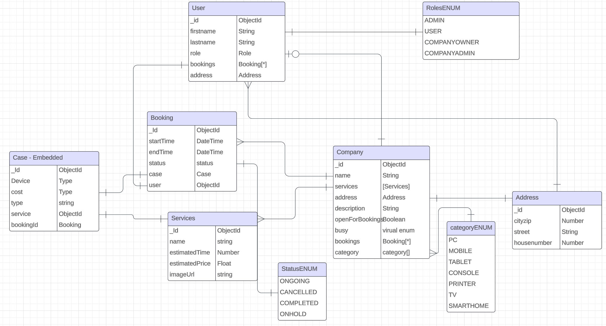

# RepIt

## Project Description
Our app is like Wolt, but for tech repairs. It allows users to easily find and schedule repair services for their tech devices.

## Technical Requirements

This section outlines the technical requirements and dependencies for the project.

### Database

- **MongoDB**: MongoDB is used as the database system.
- **Mongoose**: Mongoose is utilized as an Object Data Modeling (ODM) library for MongoDB and Node.js.

### Backend

- **Express**: Express.js is used as the backend web application framework for Node.js.
- **GraphQL**: GraphQL is employed as the query language for the API.
- **Apollo Server**: Apollo Server is utilized to create a GraphQL server.

### Frontend

- **React**: React.js is used as the frontend JavaScript library for building user interfaces.
- **Apollo Client**: Apollo Client is utilized for managing GraphQL data in the client-side application.
- **Typescript**: TypeScript is used as the primary programming language for writing type-safe JavaScript code.

### Styling

- **Tailwind CSS**: Tailwind CSS is used as the utility-first CSS framework for styling the user interface.

- **Shadcn**: A component library, where you get the sourcecode for all the components you need, therefore making it customizable. The library is building on Radix components, therefore making the accesibiltiy on the page fantastic.
[ShadCn](https://ui.shadcn.com/)

## Project Prototype (Figma)
[Link to Figma Prototype](https://www.figma.com/file/LbQBCQXXkOSp0jUBOCexN6/FullStack?type=design&node-id=0%3A1&mode=design&t=CTflDUWxHEojKWO3-1)


# Routes Documentation
## Root Route

- **Path:** `/`
- **Element:** `<App />`
  
  ### Nested Routes:
  
  - **Index Route**
    - **Path:** `/`
    - **Element:** `<Index />`
    
  - **Search Route**
    - **Path:** `/search`
    - **Element:** `<Search />`
    
  - **Company Route**
    - **Path:** `/company`
    
      #### Nested Routes:
      
      - **Company Home Page Route**
        - **Path:** `/company/:id`
        - **Element:** `<CompanyHomePage />`
        
      - **Company Booking Page Route**
        - **Path:** `/company/:id/booking`
        - **Element:** `<CompanyBookingPage />`
        
      - **Protected Admin Route**
        - **Path:** `/company/:id/admin`
        - **Element:** `<ProtectedRoute>`
        - **Authentication Checks:**
          - Check if the user is associated with the company whose ID is specified in the route parameters.
          - Check if the user has an `ADMIN` role.

## Other Routes

- **Login Route**
  - **Path:** `/login`
  - **Element:** `<Login />`

- **Signup Route**
  - **Path:** `/signup`
  - **Element:** `<Signup />`

- **Catch-all Route**
  - **Path:** `*`
  - **Element:** `<ErrorPage />`

### Database EER diagram
[EER](https://lucid.app/lucidchart/e908afa7-3d7e-40a3-b10a-17300a5984f7/edit?invitationId=inv_009e7adf-fb80-4c81-980a-4ba6ce353409&page=0_0#)


## Project Repository Link
[Link to frontend Project Repository](https://github.com/TheRealJackiBoi/FullStackExam-Frontend)
[Link to backend Project Repository](https://github.com/TheRealJackiBoi/FullStackExam-Backend)

## Project Team Members
- Anders Hein Larsen
- Jack Oulund
- Julius Hvid Lassen


## FileStructure

```
  MERN-RepIt
├── public/
├── src
│   ├── assets
│   │   ├── logo.png
│   │   ├── logo.svg
│   │   └── react.svg
│   ├── components
│   │   ├── companyAdmins
|   |   |   ├── Columns.tsx
|   |   |   ├── CompanyAdminDataTable.tsx
|   |   |   ├── CompanyAdminTable.tsx
|   |   |   └── CompanyAdminModal.tsx
│   │   ├── CompanyBookings
|   |   |   ├── Columns.tsx
|   |   |   ├── CompanyBookings.tsx
|   |   |   └── CompanyBookingsDataTable.tsx
│   │   ├── ui
|   |   |   ├── avatar.tsx
|   |   |   ├── badge.tsx
|   |   |   ├── button.tsx
|   |   |   ├── calender.tsx
|   |   |   ├── card.tsx
|   |   |   ├── command.tsx
|   |   |   ├── dialog.tsx
|   |   |   ├── dropdown-menu.tsx
|   |   |   ├── form.tsx
|   |   |   ├── input.tsx
|   |   |   ├── label.tsx
|   |   |   ├── mode-toggle.tsx
|   |   |   ├── navigation-menu.tsx
|   |   |   ├── popover.tsx
|   |   |   ├── select.tsx
|   |   |   ├── separator.tsx
|   |   |   ├── skeleton.tsx
|   |   |   ├── table.tsx
|   |   |   ├── toast.tsx
|   |   |   ├── toaster.tsx
|   |   |   └── use-toast.ts
│   │   ├── CategoryCard.tsx
│   │   ├── CategoryCards.tsx
│   │   ├── CategoryForm.tsx
│   │   ├── CompanyAdminServiceTable.tsx
│   │   ├── CompanyCard.tsx
│   │   ├── CreateServiceModal.tsx
│   │   ├── DeleteServiceButton.tsx
│   │   ├── DescriptionForm.tsx
│   │   ├── Navbar.tsx
│   │   ├── ServiceCard.tsx
│   │   ├── theme-provider.tsx
│   │   └── Typography.tsx
│   ├── graphql
│   │   ├── booking
|   |   |   ├── bookingMutations.ts
|   |   |   └── bookingQueries.ts
│   │   ├── company
|   |   |   ├── companyMutations.ts
|   |   |   └── companyQueries.ts
│   │   ├── service
|   |   |   ├── serviceMutations.ts
|   |   |   └── serviceQueries.ts
│   │   ├── user
|   |   |   └── userQueries.ts
│   │   └── authQueries.ts
│   ├── pages
│   │   ├── 404.tsx
│   │   ├── CompanyAdminPage.tsx
│   │   ├── CompanyBookingPage.tsx
│   │   ├── CompanyHomePage.tsx
│   │   ├── index.tsx
│   │   ├── Login.tsx
│   │   ├── MainLayout.tsx
│   │   ├── Search.tsx
│   │   └── Signup.tsx
│   ├── schema
│   │   ├── admin.ts
│   │   ├── booking.ts
│   │   ├── companyCategory.ts
│   │   ├── companyDescription.ts
│   │   ├── login.ts
│   │   ├── service.ts
│   │   └── Signup.ts
│   ├── types
│   │   ├── addressTypes.ts
│   │   ├── authTypes.ts
│   │   ├── bookingTypes.ts
│   │   ├── categoryEnum.ts
│   │   ├── companyTypes.ts
│   │   ├── router.ts
│   │   ├── serviceTypes.ts
│   │   └── usertypes.ts
│   ├── types
│   │   ├── AuthContext.tsx
│   │   ├── authFacade.ts
│   │   └── ProtectedRoutes.tsx
│   ├── App.tsx
│   ├── index.css
│   ├── index.d.ts
│   ├── index.css
│   ├── main.jsx
│   ├── utilities.ts
│   └── vite-env.d.ts
├── .eslintrc.cjs
├── .gitignore
├── components.json
├── index.html
├── package-lock.json
├── package.json
├── postcss.config.js
├── tailwind.config.js
├── tsconfig.js
├── tsconfig.node.json
├── vite.config.js
└── README.md
```